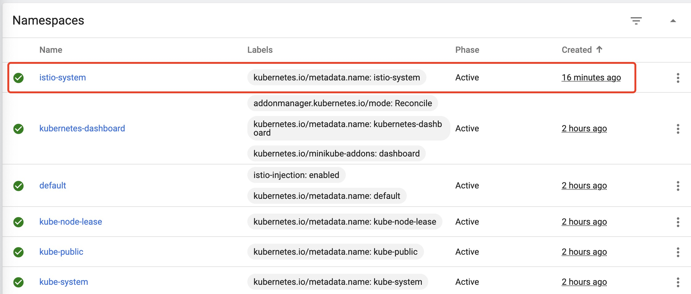

# Istio环境搭建

&ensp;&ensp;&ensp;&ensp;本文从头介绍Istio环境的搭建流程。

> 操作系统：MacOS

## 1. 环境准备

&ensp;&ensp;&ensp;&ensp;由于是本机环境，需先搭建一个基础K8S环境，搭建环境时推荐使用`minikube`，您也可以直接参考下边链接搭建：[Minikube](https://minikube.sigs.k8s.io/docs/start/)。

> 如果您英文不错推荐走官方流程，更详细。

### 1.1. 安装Xhyve

在MacOS中安装minikube之前，需要先安装一个VM环境，推荐`xhyve`：

```shell
brew install docker-machine-driver-xhyve

# docker-machine-driver-xhyve 需要Root权限，执行完后再依次执行下边两个命令
sudo chown root:wheel $(brew --prefix)/opt/  \
    docker-machine-driver-xhyve/bin/docker-machine-driver-xhyve
sudo chmod u+s $(brew --prefix)/opt/  \
    docker-machine-driver-xhyve/bin/docker-machine-driver-xhyve
```

### 1.2. 安装minikube

**直接安装**

根据官方文档执行下边命令（需翻墙访问Google）

```shell
curl -LO https://storage.googleapis.com/ \
    minikube/releases/latest/minikube-darwin-amd64
sudo install minikube-darwin-amd64 /usr/local/bin/minikube
```

**brew安装**

```shell
brew install minikube
# 旧版本（BigSur以下）
brew cask install minikube
```


### 1.3. 安装Kubernate Client

```shell
brew install kubectl
```


## 2. 环境测试

&ensp;&ensp;&ensp;&ensp;默认的虚拟机环境使用的是hyperkit，如果您想调整可参考链接：[虚拟机驱动](https://minikube.sigs.k8s.io/docs/drivers/)。

### 2.1. 启动minikube

&ensp;&ensp;&ensp;&ensp;执行启动命令

```shell
minikube start
minikube start --driver=virtualbox    # 切换到VirtualBox（推荐不解释）
```


> 第一次启动由于要下载虚拟机镜像，速度会慢点，之后就很快了。

&ensp;&ensp;&ensp;&ensp;如果您不能访问外网，可能会看到如下警告：


&ensp;&ensp;&ensp;&ensp;等待启动完成，您可以看到命令行结果：


### 2.2. 打开dashboard

&ensp;&ensp;&ensp;&ensp;运行Dashboard的核心命令（第一次很慢）：

```shell
minkkube dashboard
```


&ensp;&ensp;&ensp;&ensp;运行后您的浏览器会自动打开，这样K8S环境就搭建好了：


## 3. Istio安装

参考链接：[Getting Started](https://istio.io/latest/docs/setup/getting-started/)

### 3.1. 下载Istio

> 进入一个空目录，此处我用了`~/Runtime/service-mesn/`。

```shell
curl -L https://istio.io/downloadIstio | sh -
```


&ensp;&ensp;&ensp;&ensp;下载完成后，修改您的环境变量，将`istio-1.11.0/bin`设置到您的`$PATH`中，您可以选择重命名该目录，如此操作后，您的`istioctl`命令就应该可以使用了（记得用`source`或重开命令行）。

### 3.2. 安装Istio

&ensp;&ensp;&ensp;&ensp;执行下边命令安装第一个istio：

```shell
istioctl install --set profile=demo -y
```

&ensp;&ensp;&ensp;&ensp;此处profile参数依赖配置文件，如果随便写会出现如下错：

```shell
istioctl install --set profile=zero -y
generate config: failed to read profile zero from : \
    open profiles/zero.yaml: file does not exist
```

&ensp;&ensp;&ensp;&ensp;先老老实实直接使用demo，然后等待安装完成：


&ensp;&ensp;&ensp;&ensp;最后一步是在您的minikube中default名空间中添加istio：

```shell
kubectl label namespace default istio-injection=enabled
```

&ensp;&ensp;&ensp;&ensp;到这里您的基本步骤就算完成了，istio也算是装上了，若读者想有更深入的了解，可以参考官方文档把**后续步骤**全部做完，包括发布第一个应用等等。您也可以回到刚刚那个dashboard查看结果：



## 4. 小结

&ensp;&ensp;&ensp;&ensp;本文主要讲解了在MacOS中安装K8S环境和istio，为最基础的环境搭建的Guide。


