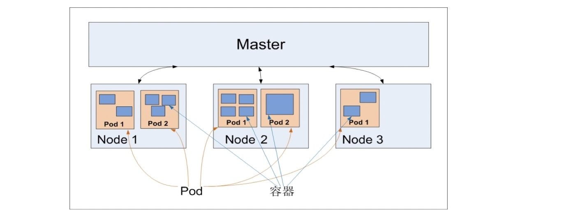

# K8S基本概念

## 1. 资源对象

### 分类

&ensp;&ensp;&ensp;&ensp;K8S中主要对象为资源对象——**Resource Object**，分两大类：

1. 名词类：节点 Node、Pod、服务 Service、存储卷 Volume。
3. 相关事物和动作：标签 Label、注解 Annoation、名空间 Namespace、部署 Deployment、HPA、PVC

&ensp;&ensp;&ensp;&ensp;资源对象通用属性：`版本、类别（Kind）、名称、标签、注解`，结构参考下边片段：

```yaml
apiVersion: v1
kind: Service
metadata:
    name: xxx
    labels:
        first: xxx
```

> 名称、标签、注解同属metadata节点。

&ensp;&ensp;&ensp;&ensp;配置文件格式可使用JSON或YAML（后者居多），这些配置全部都保存在etcd中，您可使用kubectl工具对其进行各种操作。

### 特征

* 名称必须唯一。
* 标签很重要（K8S设计亮点）
    * 表明资源对象特征、类别。
    * 实现对象之间关联、控制、协作。
* 注解是特殊标签，和程序挂钩实现自定义扩展。

### 生命周期

> 部分资源对象带有生命周期如Pod

|状态|周期|
|---|:---|
|Pending|等待调度、调度完成过后。|
|Running|镜像下载、启动、启动成功过后。|
|Succeeded|正常停止后。|
|Failed|非正常停止后。|

## 2. 四大类

### 2.1. 集群类

&ensp;&ensp;&ensp;&ensp;集群Cluster由Master和Node两种节点组成。

#### 2.1.1. Master

&ensp;&ensp;&ensp;&ensp;Master负责管理和控制，每个K8S集群中都需要有**一个**或**一组**（HA环境中最少3台服务器，Master占一台独立服务器）。


|进程|名称/责任|
|:---|---|
|kube-apiserver|Kubernates API Server|
||提供RESTful API的主服务，增删改唯一入口。|
|kube-controller-manager|Kubernates Controller Manager|
||所有资源对象自动化控制中心——总管。|
|kube-scheduler|Kubernates Scheduler|
||负责资源调度的进程。|

> 除此在Master上需部署etcd服务。

#### 2.1.2. Node

> 旧版又称Minion。

&ensp;&ensp;&ensp;&ensp;工作负载节点，某个宕机会自动转移到另外一个。

|进程|名称/责任|
|:---|---|
|kubelet|Pod容器的创建、启停任务。|
|kube-proxy|实现K8S Service的通信和负载均衡。|
|运行时容器（Docker）|负责本机的容器创建以及管理。|

&ensp;&ensp;&ensp;&ensp;Node自检结果

|状态|含义|
|---|:---|
|Ready|健康就绪状态。|
|DiskPressure|磁盘空间不足。|
|MemoryPressure|内存不足。|
|NetworkUnavailable|网络异常。|
|PIDPressure|PID资源不足。|

```shell
# 查看
kubectl get nodes
# 详细信息
kubectl describe node <node_name>
```

#### 2.1.3. Namespace

&ensp;&ensp;&ensp;&ensp;用于实现多租户隔离，每个租户分配一个命名空间。安装完成和运行后Master会创建两个默认名空间：

* default：默认的（用户资源对象）
* kube-system：系统级的（网络、DNS、监控类）

&ensp;&ensp;&ensp;&ensp;定义片段如下

```yaml
# 名空间定义
apiVersion: v1
kind: Namespace
metadata:
    name: development
# 名空间使用
apiVersion: v1
kind: Pod
metadata:
    name: busybox
    namespace: development
```

&ensp;&ensp;&ensp;&ensp;定义名空间过后执行命令会有所区别：

```shell
# 无法查询对应的Pod对象
kubectl get pods
# 必须加上名空间参数才能读取相关资源组件
kubectl get pods --namespace=development
```

### 2.2. 应用类

&ensp;&ensp;&ensp;&ensp;应用类是K8S中重点学习的一类资源对象（因为最多）。

#### 2.2.1. Service/Pod

&ensp;&ensp;&ensp;&ensp;这两个服务组件围绕Service和Pod两个概念展开，Pod一般不提供正式翻译：

1. Service表示无状态服务（拥有全局唯一虚拟ClusterIP地址）
    服务的唯一标识：**Service Name（域名）+ ClusterIP + Port**

    
1. Pod是K8S中最重要概念，每个Pod有一个**Pause根容器**，结构如下：
    

&ensp;&ensp;&ensp;&ensp;Pod在K8S中的作用：

* 多进程之间协作的抽象模型，作为基本调度、复制、管理工作的最小单元，让多个应用之间可有效地调度和伸缩。
* 多个业务容器共享Pause容器IP、共享挂载的Volume，解决容器之间通信问题和文件共享问题。

&ensp;&ensp;&ensp;&ensp;K8S会给Pod分配唯一IP地址，使得K8S支持任意两个Pod之间直接通信，Pod内容器共享该地址，所以内部容器和另外Pod容器可直接通信。

|Pod类型|存储位置|
|---|:---|
|普通Pod|存储在etcd中。|
|静态Pod|存储在某个具体Node的文件中。|

&ensp;&ensp;&ensp;&ensp;Pod和Node之间关系如下：



> Pod Volume和Docker Volume是等价概念。

**Event**

&ensp;&ensp;&ensp;&ensp;K8S中的Event是一个时间记录，它记录了该事件的所有属性，通常会被关联到某个具体资源对象上，作为故障排查的重要参考信息，将三者结合的结构图如：


#### 2.2.2. Label和标签选择器

&ensp;&ensp;&ensp;&ensp;标签特征：

1. 一个`key = value`的键值对，用户自定义。
2. 一个资源对象上可以定义任意数量的Label。
3. 同一个Label也可以被添加到任意数量的资源对象上。

&ensp;&ensp;&ensp;&ensp;常用标签：

|标签类型|文字|
|---:|:---|
|版本|release: stable, release: canary|
|环境|environment: dev, environment: qa, environment: production|
|架构|tier: frontend, tier: backend, tier: middleware|
|分区|partition: customerA, partition: customerB|
|质量管控|track: daily, track: weekly|

&ensp;&ensp;&ensp;&ensp;标签选择器Label Selector表达式：

1. 基于等式（Equality-based）：等于`=`，不等于`!=`。
2. 基于集合（Set-based）：存在`in (x,y)`，不存在`not in (x,y)`。

> 多个之间的连接词是"AND"，标签选择器可根据不同组设置（筛选专用）。

#### 2.2.3. Pod和Deployment

&ensp;&ensp;&ensp;&ensp;**职责**：避免手工创建Pod，提供Pod模板（Template），然后程序根据指定模板创建指定数量Pod实例。——发生宕机时还可实现自动控制。

```yaml
apiVersion: apps/v1
kind: Deployment
spec:
    replicas: 2
    selector:
        matchLabels:
            xxx: vvv
    template:
```

|属性名|含义|
|:---|:---|
|replicas|Pod的副本数量。|
|selector|目标Pod的标签选择器。|
|template|自动创建新Pod副本的模板。|

&ensp;&ensp;&ensp;&ensp;查看命令：

```shell
# 查看Deployment情况
kubectl get deployments
# 插件ReplicaSet
kubectl get replicaset
# 查看Pods
kubectl get pods
```

&ensp;&ensp;&ensp;&ensp;Deployment的输出结果中：

|字段|含义|
|:---|:---|
|DESIRED|Pod副本期望值，replicas。|
|CURRENT|当前replicas值。|
|UP-TO-DATE|最新版本副本数。|
|AVAILABLE|集群中可用副本总数。|

&ensp;&ensp;&ensp;&ensp;Pod、Deployment、Service关系：


#### 2.2.4. Service的ClusterIP

&ensp;&ensp;&ensp;&ensp;虚拟IP特征：

1. ClusterIP地址仅作用于Kubernets Services对象，由K8S管理和分配IP，与Node以及Master的物理网络完全无关。
2. 没有**实体网络对象**，无法ping通，只能与Service Port组成具体访问端，不具备TCP/IP通信基础。
3. 属于K8S集群的封闭控件，集群外节点若访问需做额外工作。

&ensp;&ensp;&ensp;&ensp;查看服务的ClusterIP：

```shell
kubectl get svc <name> -o yaml
```

&ensp;&ensp;&ensp;&ensp;输出信息：

```yaml
spec:
    clusterIP: xxx
    ports:
    - port: xxx
      protocol: TCP
      targetPort: 8080
```

&ensp;&ensp;&ensp;&ensp;targetPort实际上是该Service服务暴露（Expose）出来的端口号，业务进程在targetPort上提供**TCP/IP接入**。Headless Service（另一种）——设置clusterIP: None，它没有ClusterIP地址，若解析DNS域名则返回全部Pod的EndPoint列表，业务进程直接与Pod建**TCP/IP通信**；这种通信性能最高，又称“原生网络通信”。

#### 2.2.5. 外网访问Service


