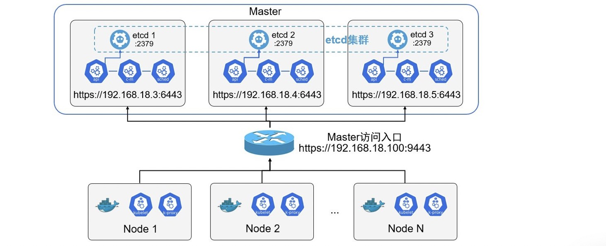

# 配置参考

## 1. 基本要求

### 1.1. 软件和硬件

|软硬件|最低|推荐|
|---|:---|:---|
|主机资源|集群最好 1 ~ 5 个节点，要求：<br/>* Master：1-CPU 和 2GB内存<br/>* Node: 1-CPU 和 1GB内存。<br/>随着集群规模加大，应增加主机配置，参考官方建议。|Master：4-CPU 和 16GB内存<br/>Node工具运行容器数量配置。|
|Linux操作系统|各种Linux发行版，Kernel > 3.10。|CentOS 7.8|
|etcd|v3 版本以及以上。|v3|
|Docker|推荐使用19.03或以上。|19.03|

### 1.2. 防火墙端口

|组件|默认端口|
|:---|:---|
|API Server|8080（HTTP非安全端口）<br/>6443（HTTPS安全端口）|
|Controller Manager|10252|
|Scheduler|10251|
|kubelet|10250<br/>10255（只读端口）|
|etcd|2379（客户端访问）<br/>2380（集群内部节点访问）|
|集群DNS服务|53（UDP）<br/>53（TCP）|

> 其他防火墙端口视情况而定，在安全内网环境中，也可以直接关闭防火墙。

```shell
systemctl disable firewalld
systemctl stop firewalld
```

&ensp;&ensp;&ensp;&ensp;另外，在主机上禁用SELinux（修改/etc/sysconfig/selinux），设置`SELINUX=disabled`。

## 2.高可用

### 2.1. 基本架构

&ensp;&ensp;&ensp;&ensp;在正式环境中确保Master高可用，并启用安全机制，最少包含如下：

1. Master的`kube-apiserver、kube-controller-manager、kube-scheduler`服务最少以3个节点的多实例方式部署。
2. Master启用基于CA认证的HTTPS安全机制。
3. etcd至少以3个节点的集群模式部署。
4. etcd集群启用基于CA认证的HTTPS安全机制。
5. Master启用RBAC授权模式

&ensp;&ensp;&ensp;&ensp;完整架构图：




### 2.2. CA证书

&ensp;&ensp;&ensp;&ensp;可选择：`openssl, easyrsa, cfssl`。

```shell
openssl genrsa -out ca.key 2048
openssl req -x509 -new -nodes -key ca.key -subj "/CN=192.168.18.3" -days 36500 -out ca.crt
```

|参数|含义|
|:---|:---|
|-subj|/CN 的值为Master主机名或IP地址。|
|-days|设置整数有效期。|

&ensp;&ensp;&ensp;&ensp;生成的`ca.key, ca.crt`文件保存在`/etc/kubernetes/pki`目录中。

> 后续细节本文就不累赘了。

## 3. 小结

&ensp;&ensp;&ensp;&ensp;本文主要记录K8S的环境需求以及环境相关配置。

