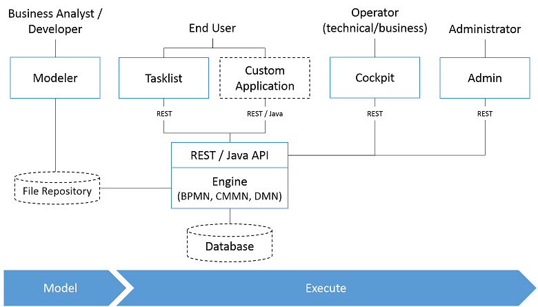

&ensp;&ensp;&ensp;&ensp;Comunda整体结构如下：

# 1. 总体结构

* 流程引擎和基础结构
    * Process Engine：支持规范

        |规范|版本|
        |---|---|
        |BPMN|2.0|
        |CMMN|1.1|
        |DMN|1.3|
    * Spring框架集成
    * CDI/Java EE集成
    * 运行容器集成
* 建模工具Modeler
    * 后端：Communda Modeler
    * 前端：[bpmn.io](https://bpmn.io/)
* Web应用
    * RESTful API
    * Tasklist任务平台
    * Cockpit监控平台
    * Admin管理后台
