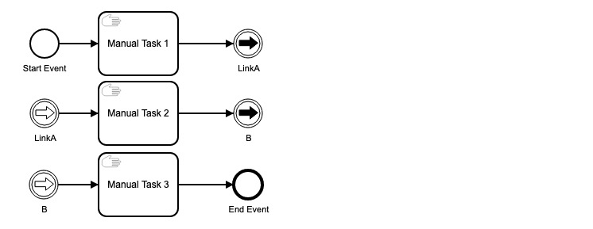

官方站点：<http://www.omg.org/>

# 1. 建模一致性

* 附件：[BPMN 2.0](/note/camunda/pdf/BPMN%202.0.pdf)

## 1.1. 流程建模一致性

|BPMN包|说明|
|---|---|
|BPMN核心元素|包含基础结构、基础、公共和服务中定义的元素包。|
|流程图|包含流程、活动、数据和人员交互中定义的元素。|
|协作图|包括池和消息流。|
|会话图|包含池、会话和会话链接。|

&ensp;&ensp;&ensp;&ensp;完整建模一致性，BPMN中定义了三个子类：

|原文|子类|说明|
|---|---|---|
|Descriptive|描述性|和高级建模中可见元素和属性有关。|
|Analytic|分析性|包含完整过程建模中符合所有描述性的元素等。|
|Common Executable|通用可执行文件|专注于可执行流程模型所需元素。|

> BPMN 2.0不支持编排模型，下边表格为XML中的Element和Attribute。

&ensp;&ensp;&ensp;&ensp;支持子类的工具必须满足下边条件：

* 必须支持子类中所有元素。
* 对每个元素，必须支持所有列出的属性。
* 通常，如果子类未提及属性且架构上没有要求，则该属性不在子类中。

> 详细内容参考附件中的`2.2.2 BPMN Process Elements`

# 2. BPMN 2.0

## 2.1. BPMN范围（Scope）

&ensp;&ensp;&ensp;&ensp;以下是从BPMN 1.2扩展的范围和功能：

* 正规化所有BPMN元素和执行语义。
* 为流程模型扩展和图形扩展定义可扩展性机制。
* 完善事件的组成和相关性。
* 扩展和人互动的定义。
* 定义编排模型。

&ensp;&ensp;&ensp;&ensp;以下是超出国际标准范围的部分：

* 定义组织模型和资源
* 功能故障建模
* 数据和信息模型
* 策略模型
* 业务规则模型

## 2.2. BPMN用途

&ensp;&ensp;&ensp;&ensp;端到端BPMN模型中存在三种子模型：

* 流程（编排）：
    * 私有的非可执行（内部）业务流程
    * 私有可执行（内部）业务流程
    * 公共程序
* 组合流程（Choreographies）
* 写作，包括流程/编排
    * 对话视图（Conversations）

### 2.2.1. 私有业务流程


&ensp;&ensp;&ensp;&ensp;私有进程有两种类型：**可执行/不可执行**——不可执行流程是已建模的专用流程，目的是在建模者定义的详细级别上记录流程行为。

### 2.2.2. 公共程序


&ensp;&ensp;&ensp;&ensp;公共流程表示私有业务流程与另一个流程或参与者之间的交互，公共流程中仅包括那些用于与其他参与者交流的活动，原图中没有下边这个框，Modeler中目前没找到绘制的方法（下边是原图）。


### 2.2.3. 协同合作

&ensp;&ensp;&ensp;&ensp;协作描述了两个或多个业务实体之间的交互，通常包含两个或多个池，代表协作中的参与者，此时直接连接池中对象。


### 2.2.4. 组合流程

&ensp;&ensp;&ensp;&ensp;独立的组合流程（无池或编排）表示交互参与者之间预期行为的定义，一般为程序上的契约，它看起来比较像私有业务流程，由活动、事件和网关组成。编排和私有不同的地方是一个“活动”代表一组消息交换的交互，涉及两个或多个参与者（**中英双份**）。


### 2.2.5. 会话图

&ensp;&ensp;&ensp;&ensp;会话图是协作图中的一种特殊用法，也是对协作图的非正式描述，但会话中不包含流程，通常不会在“对话”图的池之间放置编排（**中英双份**）。


## 2.3. BPMN元素

&ensp;&ensp;&ensp;&ensp;BPMN元素的五个基本类别：

1. 流对象：Flow Objects，定义业务流程行为的主要图形元素
    1. 事件：Events
    2. 活动项：Activities
    3. 网关：Gateways
2. 数据：Data
    1. 数据对象：Data Objects
    2. 数据输入：Data Inputs
    3. 数据输出：Data Outputs
    4. 数据存储库：Data Stores
3. 连接对象：Connecting Objects，有四种方法将这些对象彼此连接
    1. 顺序流：Sequence Flows
    2. 消息流：Message Flows
    3. 关联：Associations
    4. 数据关联：Data Associations
4. 泳道：Swimlanes，泳道负责将建模元素分组
    1. 池化：Pools
    2. 泳道：Lanes
5. 工件：Artifacts，用于提供有关流程的其他信息，有两个标准工件，建模者或工具也可以自定义。
    1. 组：Group
    2. 文字注解：Text Annotation

### 2.3.1. BPMN建模元素

|元素|符号|扩展符号|
|---|---|---|
|Event|||
|Type Dimension||参考表格之后的完整定义表|
|Activity|||
|Task（Atomic）|||
|Choreography Task|||
|Process/Sub-Process（non-atomic）||参考之后四个子流程|
|Collapsed Sub-Process|||
|Expanded Sub-Process|||
|Collapsed Sub-Choreography|||
|Expanded Sub-Choreography|||
|Gateway|||
|Gateway Control Types|||
|Sequence Flow|||
|Normal Flow|||
|Uncontrolled Flow|||
|Conditional Flow|||
|Default Flow|||
|Exception Flow|||
|Message Flow|||
|Association|||
|Compensation Association|||
|Pool|||
|Lane|||
|Data Object|||
|Data Object|||
|Message|||
|Group|||
|Text Annotation|||
|**以下元素是非基本元素扩展**|
|Fork|||
|Join|||
|Decision, Branching Point|查看下边四种（选择类控制流程）||
|Exclusive|||
|Event-Based|||
|Inclusive||||
|Merging|||
|Looping|查看下边两种（循环类控制流程）||
|Activity Looping|||
|Sequence Flow Looping|||
|Multiple Instances|||
|Process Break|||
|Transaction|||
|Nested/Embedded Sub-Process||无图标对应|
|Off-Page Connector|||

**完整定义表**


## 2.4. BPMN图类型

&ensp;&ensp;&ensp;&ensp;以下是使用BPMN 2.0可以建模的业务流程示例：

* 高级别非可执行活动流程（非功能细分）
* 详细的可执行业务流程
* 原样或旧业务流程
* 准或新业务流程
* 两个或更多业务者参与（组合）之间预期行为的描述
* 详细的私有业务流程（可执行/不可执行），与一个或多个外部交互实体
* 两个或更多详细的可执行进程进行交互
* 与编排的详细的可执行业务流程关系
* 两个或多个公共流程
* 与编排的公共流程关系
* 通过编排进行交互的两个或更多详细可执行业务流程

## 2.5. 流对象连接规则

> `o`符号表示这个对象之间可以直接做连接。

### 2.5.1. 顺序流

|From/To|||||||
|---|---|---|---|---|---|---|
|||‰|o|o|o|o|
|||‰|o|o|o|o|
|||‰|o|o|o|o|
|||‰|o|o|o|o|
|||‰|o|o|o|o|
|||||||

### 2.5.2. 消息流

|From/To|||||||
|---|---|---|---|---|---|---|
||||||||
||^|o|o|o|o||
||^|o|o|o|o||
||^|o|o|o|o||
||^|o|o|o|o||
||^|o|o|o|o||

## 2.6. BPMN核心结构


&ensp;&ensp;&ensp;&ensp;核心包含四个子包：

1. Infrastructure：用于抽象语法模型和图模型两个元素
2. Foundation：BPMN建模所需的基本构造
3. Service：对服务和接口进行建模所需的基本构造
4. Common：处理，编排和写作各层公有类


&ensp;&ensp;&ensp;&ensp;其他所有详细内容和原理参考附件中的其他部分，本文主要处理图形部分，然后结合Camunda教程定义相关流程以及在产品中集成这部分内容。

# 3. Comunda对BPMN 2.0的支持

* **橙色**是支持的符号元素，黑色是不支持的。

## 3.1. Symbol: Participants


## 3.2. Symbol: Subprocesses


## 3.3. Symbol: Tasks


## 3.4. Symbol：Gateway


## 3.5. Symbol：Data/Artifacts


## 3.6. Event


# 4. 「Task」Comunda中BPMN任务

## 4.1. 服务任务：Service Task


### 4.1.1. 基本调用

&ensp;&ensp;&ensp;&ensp;四种定义和Java调用逻辑：

* 定义一个实现了`JavaDelegate`或`ActivityBehavior`接口的类，`camunda:class`：

    ```xml
    <serviceTask id="javaService"
             name="My Java Service Task"
             camunda:class="org.camunda.bpm.MyJavaDelegate" />
    ```

* 使用表达式解析一个`delegation`的Java对象，`camunda:delegateExpression`：

    ```xml
    <serviceTask id="beanService"
             name="My Bean Service Task"
             camunda:delegateExpression="${myDelegateBean}" />
    ```
* 调用方法表达式或值表达式，`camunda:expression`：

    ```xml
    <serviceTask id="expressionService"
             name="My Expression Service Task"
             camunda:expression="${myBean.doWork()}" />
    ```

* 还有一种调用方法是直接使用`REST/SOAP`接口，`camunda:connector`。

### 4.1.2. Service Task执行结果

&ensp;&ensp;&ensp;&ensp;您可以将执行结果存储在变量中：

```xml
<serviceTask id="aMethodExpressionServiceTask"
           camunda:expression="#{myService.doSomething()}"
           camunda:resultVariable="myVar" />
```

### 4.1.3. External Task外联任务

```xml
<serviceTask id="anExternalServiceTask"
           camunda:type="external"
           camunda:topic="ShipmentProcessing" />
```

## 4.2. 发送任务：Send Task


&ensp;&ensp;&ensp;&ensp;发送任务主要用来发送一个消息出去。

```xml
<sendTask id="sendTask" camunda:class="org.camunda.bpm.MySendTaskDelegate" />
```

## 4.3. 用户任务：User Task


&ensp;&ensp;&ensp;&ensp;用户任务必须被人工执行和处理：

```xml
<userTask id="theTask" name="Important task" />
```

### 4.3.1. 任务描述

```xml
<userTask id="theTask" name="Schedule meeting" >
  <documentation>
      Schedule an engineering meeting for next week with the new hire.
  </documentation>
```

```java
// Java代码
task.getDescription();
```

### 4.3.2. 属性

&ensp;&ensp;&ensp;&ensp;下边片段用来定义该任务的最后期限：

```xml
<userTask id="theTask" name="Important task" camunda:dueDate="${dateVariable}"/>
```

&ensp;&ensp;&ensp;&ensp;下边片段用来定义下一个任务执行的时间：

```xml
<userTask id="theTask" name="Important task" camunda:followUpDate="${dateVariable}"/>
```

### 4.3.3. 派工

#### BPMN资源派工

1. 人工执行：Human Performer

    ```xml
    <userTask id='theTask' name='important task' >
        <humanPerformer>
            <resourceAssignmentExpression>
                <formalExpression>kermit</formalExpression>
            </resourceAssignmentExpression>
        </humanPerformer>
    </userTask>
    ```

    ```java
    // Java代码
    List<Task> tasks = taskService.createTaskQuery().taskAssignee("kermit").list();
    ```
2. 可能拥有者：Potential Owner

    ```xml
    <userTask id='theTask' name='important task' >
        <potentialOwner>
            <resourceAssignmentExpression>
                <formalExpression>user(kermit), group(management)</formalExpression>
            </resourceAssignmentExpression>
        </potentialOwner>
    </userTask>
    ```

    ```java
    // Java代码
    List<Task> tasks = taskService.createTaskQuery().taskCandidateUser("kermit");
    ```

    下边两段代码是等价的：

    ```xml
    <formalExpression>accountancy</formalExpression>
    <formalExpression>group(accountancy)</formalExpression>
    ```

#### Camunda扩展派工

1. 被派工者：Assignee

    ```xml
    <userTask id="theTask" name="my task" camunda:assignee="kermit" />
    ```
2. 候选用户：Candidate Users

    ```xml
    <userTask id="theTask" name="my task" camunda:candidateUsers="kermit, gonzo" />
    ```
3. 候选组：Condidate Groups

    ```xml
    <userTask id="theTask" name="my task" camunda:candidateGroups="management, accountancy" />
    ```
4. 组合候选用户和组

#### 基于服务逻辑和数据派工

1. 派工表达式：
    1. 流程变量

        ```xml
        <startEvent id="startEvent" camunda:initiator="starter" />
        <userTask id="task" name="Clarify Invoice" camunda:assignee="${ starter }"/>
        ```
    2. 调用服务/Bean

        ```xml
        <userTask id="task" name="My Task" camunda:assignee="${ldapService.findManagerForEmployee(emp)}"/>
        <userTask id="task" name="My Task" camunda:candidateUsers="${ldapService.findAllSales()}"/>
        ```

        ```java
        // Java代码
        public class FakeLdapService {
            public String findManagerForEmployee(String employee) {
                return "Kermit The Frog";
            }

            public List<String> findAllSales() {
                return Arrays.asList("kermit", "gonzo", "fozzie");
            }
        }
        ```
2. 监听器派工

    ```xml
    <userTask id="task1" name="My task" >
        <extensionElements>
            <camunda:taskListener event="create" class="org.camunda.bpm.MyAssignmentHandler" />
        </extensionElements>
    </userTask>
    ```

    ```java
    // Java代码
    public class MyAssignmentHandler implements TaskListener {
        public void notify(DelegateTask delegateTask) {
            // Execute custom identity lookups here
            // and then for example call following methods:
            delegateTask.setAssignee("kermit");
            delegateTask.addCandidateUser("fozzie");
            delegateTask.addCandidateGroup("management");
            // ...
        }
    }
    ```

#### 派工和标识服务

```java
// 标识服务
ProcessEngine processEngine = delegateTask.getProcessEngine();
IdentityService identityService = processEngine.getIdentityService();

List<User> managementUsers = identityService.createUserQuery()
    .memberOfGroup("management")
    .list();

User kermit = identityService.createUserQuery()
    .userFirstName("kermit")
    .singleResult();
```

### 4.3.4. 任务完成

```java
// 调用任务完成代码
taskService.complete(taskId, variables);

// or complete and retrieve the process variables
VariableMap processVariables = taskService
  .completeWithVariablesInReturn(taskId, variables, shouldDeserializeValues);
```

* 表单部分略，参考：[Task/Forms](https://docs.camunda.org/manual/7.16/reference/bpmn20/tasks/user-task/#forms)

## 4.4. 业务规则任务：Business Rule Task


### 4.4.1. DMN Engine

&ensp;&ensp;&ensp;&ensp;属性`camunda:decisionRefBinding`的值列表如下：

* **deployment**：发布后版本
* **latest**：最新版

    ```xml
    <!-- 默认值 -->
    <businessRuleTask id="businessRuleTask"
        camunda:decisionRef="myDecision" />
    ```
* **version**：使用指定版本，配合`camunda:decisionRefVersion`

    ```xml
    <businessRuleTask id="businessRuleTask"
        camunda:decisionRef="myDecision"
        camunda:decisionRefBinding="version"
        camunda:decisionRefVersion="12" />
    <!-- 使用变量 -->
    <businessRuleTask id="businessRuleTask"
        camunda:decisionRef="${decisionKey}"
        camunda:decisionRefBinding="version"
        camunda:decisionRefVersion="${decisionVersion}" />
    ```
* **versionTag**：用来执行特定版本`camunda:decisionRefVersionTag`

&ensp;&ensp;&ensp;&ensp;使用`map`数据结构处理决策结果：

```xml
<businessRuleTask id="businessRuleTask"
    camunda:decisionRef="myDecision"
    camunda:mapDecisionResult="singleEntry"
    camunda:resultVariable="result" />
```

### 4.4.2. DecisionRef租户ID

&ensp;&ensp;&ensp;&ensp;默认情况`tenant id=null`，显示指定的情况：

1. `camunda:decisionRefTenantId`指定

    ```xml
    <businessRuleTask id="businessRuleTask" decisionRef="myDecision"
        camunda:decisionRefTenantId="TENANT_1">
    </businessRuleTask>
    ```
2. 如果`tenant id`未设计过：

    ```xml
    <businessRuleTask id="businessRuleTask" decisionRef="myDecision"
        camunda:decisionRefTenantId="${ myBean.calculateTenantId(variable) }">
    </businessRuleTask>
    ```
3. 调用流程实例：

    ```xml
    <businessRuleTask id="businessRuleTask" decisionRef="myDecision"
        camunda:decisionRefTenantId="${ execution.tenantId }">
    </businessRuleTask>
    ```

### 4.4.3. 自定义规则

```xml
<businessRuleTask id="businessRuleTask"
    camunda:delegateExpression="${MyRuleServiceDelegate}" />
```

## 4.5. 脚本任务：Script Task


&ensp;&ensp;&ensp;&ensp;脚本任务定义（基于`JSR-223`）：

```xml
<scriptTask id="theScriptTask" name="Execute script" scriptFormat="groovy">
  <script>
    sum = 0
    for ( i in inputArray ) {
      sum += i
    }
  </script>
</scriptTask>
```

&ensp;&ensp;&ensp;&ensp;脚本中的变量（和Java交互）：

```xml
<!-- 从Java代码中读 -->
<script>
    sum = 0
    for ( i in inputArray ) {
      sum += i
    }
</script>
<!-- 将代码写入Java代码 -->
<script>
    sum = 0
    for ( i in inputArray ) {
      sum += i
    }
    execution.setVariable("sum", sum);
</script>
```

&ensp;&ensp;&ensp;&ensp;如果属性`autoStoreScriptVariables=true`则流程引擎会自动存储全局脚本变量，该功能为`7.0/7.1`版本中的默认功能。Script中的结果提取：

```xml
<scriptTask id="theScriptTask" name="Execute script" 
    scriptFormat="juel" camunda:resultVariable="myVar">
  <script>#{echo}</script>
</scriptTask>
```

## 4.6. 接收任务：Receive Task


&ensp;&ensp;&ensp;&ensp;这种类型的任务通常会跟随一个`message`引用：

```xml
<definitions ...>
  <message id="newInvoice" name="newInvoiceMessage"/>
  <process ...>
    <receiveTask id="waitState" name="wait" messageRef="newInvoice">
  ...
```

&ensp;&ensp;&ensp;&ensp;Java代码中操作消息：

```java
// correlate the message
runtimeService.createMessageCorrelation(subscription.getEventName())
  .processInstanceBusinessKey("AB-123")
  .correlate();
// 订阅和触发
ProcessInstance pi = runtimeService.startProcessInstanceByKey("processWaitingInReceiveTask");

EventSubscription subscription = runtimeService.createEventSubscriptionQuery()
  .processInstanceId(pi.getId()).eventType("message").singleResult();

runtimeService.messageEventReceived(subscription.getEventName(), subscription.getExecutionId());
```

&ensp;&ensp;&ensp;&ensp;任务等待：

```xml
<receiveTask id="waitState" name="wait" />
```

```java
// Java代码调用
ProcessInstance pi = runtimeService.startProcessInstanceByKey("receiveTask");
Execution execution = runtimeService.createExecutionQuery()
  .processInstanceId(pi.getId()).activityId("waitState").singleResult();

runtimeService.signal(execution.getId());
```

## 4.7. 手工任务：Manual Task


&ensp;&ensp;&ensp;&ensp;手工任务主要定义外置BPM引擎逻辑，用于手工执行该任务。

```xml
<manualTask id="myManualTask" name="Manual Task" />
```

## 4.8. 多任务实例

&ensp;&ensp;&ensp;&ensp;下边“活动（Activities）”实例可用来做多任务实例：

* Service Task
* Send Task
* User Task
* Business Rule Task
* Script Task
* Receive Task
* Manual Task
* （嵌入）Sub-Process
* Call Activity
* Transaction Subprocess

&ensp;&ensp;&ensp;&ensp;并行和串行专用任务：


&ensp;&ensp;&ensp;&ensp;属性表：

|属性名|含义|
|---|---|
|nrOfInstances|实例总数量|
|nrOfActiveInstances|当前激活的实例总数，如果是顺序型，则通常是1|
|nrOfCompletedInstances|已经完成的实例数|

* loopCounter：`For Each`迭代循环时迭代的索引值。

```xml
<!--编排-->
<multiInstanceLoopCharacteristics isSequential="false|true">
</multiInstanceLoopCharacteristics>
<!--所有数值实例会计算一次-->
<multiInstanceLoopCharacteristics isSequential="false|true">
  <loopCardinality>5</loopCardinality>
</multiInstanceLoopCharacteristics>
<!--也可以使用负值-->
<multiInstanceLoopCharacteristics isSequential="false|true">
  <loopCardinality>${nrOfOrders-nrOfCancellations}</loopCardinality>
</multiInstanceLoopCharacteristics>
```

&ensp;&ensp;&ensp;&ensp;用户定义中使用**编排**：

```xml
<!--串行-->
<userTask id="miTasks" name="My Task ${loopCounter}" camunda:assignee="${assignee}">
  <multiInstanceLoopCharacteristics isSequential="false">
    <loopDataInputRef>assigneeList</loopDataInputRef>
    <inputDataItem name="assignee" />
  </multiInstanceLoopCharacteristics>
</userTask>
<!--并行-->
<userTask id="miTasks" name="My Task" camunda:assignee="${assignee}">
  <multiInstanceLoopCharacteristics isSequential="true"
     camunda:collection="${myService.resolveUsersForTask()}" camunda:elementVariable="assignee" >
  </multiInstanceLoopCharacteristics>
</userTask>
```

### 4.8.1. 边界事件/多实例


### 4.8.2. 迭代


### 4.8.3. Json集合

```js
// 脚本处理
var collection = S('{ "collection" : ["System 1", "System 3"] }');
execution.setVariable("collection", collection);
```

```xml
<!--Xml定义-->
<multiInstanceLoopCharacteristics 
  camunda:collection="${collection.prop('collection').elements()}" 
  camunda:elementVariable="collectionElem" />
```

### 4.8.3. 补偿


# 5. 「Gateway」Comunda中的BPMN网关

## 5.1. Exclusive Gateway（XOR）


```xml
<!--对应定义-->
<exclusiveGateway id="exclusiveGw" name="Exclusive Gateway" default="flow4" />

<sequenceFlow id="flow2" sourceRef="exclusiveGw" targetRef="theTask1" name="${x==1}">
  <conditionExpression xsi:type="tFormalExpression">${x == 1}</conditionExpression>
</sequenceFlow>

<sequenceFlow id="flow3" sourceRef="exclusiveGw" targetRef="theTask2" name="${x==2}">
  <conditionExpression xsi:type="tFormalExpression">${x == 2}</conditionExpression>
</sequenceFlow>

<sequenceFlow id="flow4" sourceRef="exclusiveGw" targetRef="theTask3" name="else">
</sequenceFlow>
```

## 5.2. Sequence Flow


### 5.2.1. 条件顺序流


```xml
<sequenceFlow id="flow" sourceRef="theStart" targetRef="theTask">
  <conditionExpression xsi:type="tFormalExpression">
    <![CDATA[${order.price > 100 && order.price < 250}]]>
  </conditionExpression>
</sequenceFlow>
```

&ensp;&ensp;&ensp;&ensp;条件示例设置：

1. JavaBean风格：

    ```xml
    <conditionExpression xsi:type="tFormalExpression">
        <![CDATA[${order.price > 100 && order.price < 250}]]>
    </conditionExpression>
    ```
2. 直接调用相关方法：

    ```xml
    <conditionExpression xsi:type="tFormalExpression">
        <![CDATA[${order.isStandardOrder()}]]>
    </conditionExpression>
    ```
3. Groovy脚本：

    ```xml
    <conditionExpression xsi:type="tFormalExpression" language="groovy">
        <![CDATA[status == 'complete']]>
    </conditionExpression>
    ```
4. 外置脚本引用：

    ```xml
    <conditionExpression xsi:type="tFormalExpression" language="groovy"
        camunda:resource="org/camunda/bpm/exampe/condition.groovy" />
    ```

### 5.2.2. 默认顺序流


## 5.3. Parallel Gateway


&ensp;&ensp;&ensp;&ensp;两种类型：

* **Fork**
* **Join**

```xml
<!-- 定义 -->
<parallelGateway id="myParallelGateway" />
<!-- 流程定义 -->
<startEvent id="theStart" />
<sequenceFlow id="flow1" sourceRef="theStart" targetRef="fork" />

<parallelGateway id="fork" />
<sequenceFlow sourceRef="fork" targetRef="receivePayment" />
<sequenceFlow sourceRef="fork" targetRef="shipOrder" />

<userTask id="receivePayment" name="Receive Payment" />
<sequenceFlow sourceRef="receivePayment" targetRef="join" />

<userTask id="shipOrder" name="Ship Order" />
<sequenceFlow sourceRef="shipOrder" targetRef="join" />

<parallelGateway id="join" />
<sequenceFlow sourceRef="join" targetRef="archiveOrder" />

<userTask id="archiveOrder" name="Archive Order" />
<sequenceFlow sourceRef="archiveOrder" targetRef="theEnd" />

<endEvent id="theEnd" />
```

```java
// Java代码
ProcessInstance pi = runtimeService.startProcessInstanceByKey("forkJoin");
TaskQuery query = taskService.createTaskQuery()
                         .processInstanceId(pi.getId())
                         .orderByTaskName()
                         .asc();

List<Task> tasks = query.list();
assertEquals(2, tasks.size());

Task task1 = tasks.get(0);
assertEquals("Receive Payment", task1.getName());
Task task2 = tasks.get(1);
assertEquals("Ship Order", task2.getName());
```


## 5.4. Inclusive Gateway

&ensp;&ensp;&ensp;&ensp;两种类型：

* **Fork**
* **Join**


```xml
<!--定义-->
<inclusiveGateway id="myInclusiveGateway" />
<!-- 流程定义 -->
<startEvent id="theStart" />
<sequenceFlow id="flow1" sourceRef="theStart" targetRef="fork" />

<inclusiveGateway id="fork" />
<sequenceFlow sourceRef="fork" targetRef="receivePayment" >
<conditionExpression xsi:type="tFormalExpression">${paymentReceived == false}</conditionExpression>
</sequenceFlow>
<sequenceFlow sourceRef="fork" targetRef="shipOrder" >
<conditionExpression xsi:type="tFormalExpression">${shipOrder == true}</conditionExpression>
</sequenceFlow>

<userTask id="receivePayment" name="Receive Payment" />
<sequenceFlow sourceRef="receivePayment" targetRef="join" />

<userTask id="shipOrder" name="Ship Order" />
<sequenceFlow sourceRef="shipOrder" targetRef="join" />

<inclusiveGateway id="join" />
<sequenceFlow sourceRef="join" targetRef="archiveOrder" />

<userTask id="archiveOrder" name="Archive Order" />
<sequenceFlow sourceRef="archiveOrder" targetRef="theEnd" />

<endEvent id="theEnd" />
```

```java
// Java代码
HashMap<String, Object> variableMap = new HashMap<String, Object>();
variableMap.put("receivedPayment", true);
variableMap.put("shipOrder", true);

ProcessInstance pi = runtimeService.startProcessInstanceByKey("forkJoin");

TaskQuery query = taskService.createTaskQuery()
                         .processInstanceId(pi.getId())
                         .orderByTaskName()
                         .asc();

List<Task> tasks = query.list();
assertEquals(1, tasks.size());

Task task = tasks.get(0);
assertEquals("Ship Order", task.getName());
```

### 5.4.1. Comunda指定行为

1. 场景一：

    
2. 场景二：

    
3. 场景三：

    
4. 场景四：

    

## 5.5. Event-based Gateway

&ensp;&ensp;&ensp;&ensp;基于事件的网关：

* 这种网关必须包含两个或多个`outgoing`顺序流。
* 这种网关必须在`intermediateCatchEvent`之后。
* `intermediateCatchEvent`连接这种网关必须包含一个`ingoing`顺序流。


```xml
<definitions>
  <signal id="alertSignal" name="alert" />
  <process id="catchSignal">
    <startEvent id="start" />

    <sequenceFlow sourceRef="start" targetRef="gw1" />

    <eventBasedGateway id="gw1" />

    <sequenceFlow sourceRef="gw1" targetRef="signalEvent" />
    <sequenceFlow sourceRef="gw1" targetRef="timerEvent" />

    <intermediateCatchEvent id="signalEvent" name="Alert">
      <signalEventDefinition signalRef="alertSignal" />
    </intermediateCatchEvent>

    <intermediateCatchEvent id="timerEvent" name="Alert">
      <timerEventDefinition>
        <timeDuration>PT10M</timeDuration>
      </timerEventDefinition>
    </intermediateCatchEvent>

    <sequenceFlow sourceRef="timerEvent" targetRef="exGw1" />
    <sequenceFlow sourceRef="signalEvent" targetRef="task" />

    <userTask id="task" name="Handle alert"/>

    <exclusiveGateway id="exGw1" />

    <sequenceFlow sourceRef="task" targetRef="exGw1" />
    <sequenceFlow sourceRef="exGw1" targetRef="end" />

    <endEvent id="end" />
  </process>
</definitions>
```

# 6. 「Event」Comunda中的BPMN事件

## 6.1. 开始事件：Start Events

&ensp;&ensp;&ensp;&ensp;该流程引擎支持下边几种类型的开始事件：

* 空节点：`Blank`
* 计时节点：`Timer`
* 消息节点：`Message`
* 信号节点：`Signal`
* 条件节点：`Conditional`

&ensp;&ensp;&ensp;&ensp;异步事件定义：

```xml
<startEvent id="startEvent" camunda:asyncBefore="true" />
```

## 6.2. 空事件：None Events

```java
// 开始事件
ProcessInstance processInstance = runtimeService.startProcessInstanceByKey('invoice');
```

&ensp;&ensp;&ensp;&ensp;一个**子流程**（Subprocess）必须以一个空事件开始。


### 6.2.1. 结束空事件

```xml
<endEvent id="end" name="my end event" />
```

### 6.2.2. 中间空事件


```xml
<intermediateThrowEvent id="noneEvent">
  <extensionElements>
    <camunda:executionListener 
        class="org.camunda.bpm.engine.test.bpmn.event.IntermediateNoneEventTest$MyExecutionListener" 
        event="start" />
  </extensionElements>
</intermediateThrowEvent>
```

## 6.3. 消息事件：Message Events

### 6.3.1. 消息定义

&ensp;&ensp;&ensp;&ensp;在`BPMN 2.0`中可直接使用`messageEventDefinition`元素定义一个消息信息，然后直接使用`messageRef`来引用。

```xml
<definitions id="definitions"
  xmlns="http://www.omg.org/spec/BPMN/20100524/MODEL"
  xmlns:camunda="http://activiti.org/bpmn"
  targetNamespace="Examples"
  xmlns:tns="Examples">

  <message id="newInvoice" name="newInvoiceMessage" />
  <message id="payment" name="paymentMessage" />

  <process id="invoiceProcess">

    <startEvent id="messageStart" >
        <messageEventDefinition messageRef="newInvoice" />
    </startEvent>
    ...
    <intermediateCatchEvent id="paymentEvt" >
        <messageEventDefinition messageRef="payment" />
    </intermediateCatchEvent>
    ...
  </process>
</definitions>
```

&ensp;&ensp;&ensp;&ensp;您可以在消息定义中直接使用表达式语法：

```xml
<message id="newInvoice" name="newInvoiceMessage-${execution.processBusinessKey}" />
```

### 6.3.2. 消息API

&ensp;&ensp;&ensp;&ensp;消息类的API使用了如下规范：

* JMS（Java Messaging Service）Queue/Topic
* WebService
* REST Request

#### 运行时服务方法

```java
// correlate the message
MessageCorrelationResult result = runtimeService.createMessageCorrelation("messageName")
  .processInstanceBusinessKey("AB-123")
  .setVariable("payment_type", "creditCard")
  .correlateWithResult();
```

&ensp;&ensp;&ensp;&ensp;订阅和触发

```java
ProcessInstance pi = runtimeService.startProcessInstanceByKey("processWaitingInReceiveTask");

EventSubscription subscription = runtimeService.createEventSubscriptionQuery()
  .processInstanceId(pi.getId()).eventType("message").singleResult();

runtimeService.messageEventReceived(subscription.getEventName(), subscription.getExecutionId());
```

&ensp;&ensp;&ensp;&ensp;下边条件可引起关联消息成功：

* 流程定义Process Definition
* 执行（Process Instance）

&ensp;&ensp;&ensp;&ensp;读取结果`MessageCorrelcationResult`对象：

```java
// 直接调用
List<MessageCorrelationResult> results = runtimeService
  .createMessageCorrelation("aMessageName")
  .correlateAllWithResult();
// 读取结果
MessageCorrelationResultWithVariables result = runtimeService
  .createMessageCorrelation("aMessageName")
  .setVariable("name", "value")
  .correlateWithResultAndVariables(shouldDeserializeValues);
VariableMap processVariables = result.getVariables();
// 输入变量
List<MessageCorrelationResult> results = runtimeService
  .createMessageCorrelation("aMessageName")
  .localVariableEquals("localVarName", "localVarValue"))
  .correlateAllWithResult();
```

#### 显示触发消息

&ensp;&ensp;&ensp;&ensp;使用下边API触发消息发送

```java
ProcessInstance startedProcessInstance = runtimeService
  .createMessageCorrelation("messageName")
  .processInstanceBusinessKey("businessKey")
  .setVariable("name", "value")
  .correlateStartMessage();

// or

MessageCorrelationResultWithVariables result = runtimeService
  .createMessageCorrelation("aMessageName")
  .processInstanceBusinessKey("businessKey")
  .startMessageOnly()
  .setVariable("name", "value")
  .correlateWithResultAndVariables(shouldDeserializeValues);
ProcessInstance startedProcessInstance = result.getProcessInstance();
VariableMap processVariables = result.getVariables();
```

&ensp;&ensp;&ensp;&ensp;还有几种不同的触发方式：

```java
// 基于消息名称触发
ProcessInstance startProcessInstanceByMessage(String messageName);
ProcessInstance startProcessInstanceByMessage(String messageName, Map<String, Object> processVariables);
ProcessInstance startProcessInstanceByMessage(String messageName, 
    String businessKey, Map<String, Object> processVariables);
// 附加执行ID，接收消息
void messageEventReceived(String messageName, String executionId);
void messageEventReceived(String messageName, String executionId, 
    HashMap<String, Object> processVariables);
```

#### 查询消息订阅

```java
// 使用Process Definition Query
ProcessDefinition processDefinition = repositoryService.createProcessDefinitionQuery()
  .messageEventSubscription("newCallCenterBooking")
  .singleResult();
// 执行消息查询
Execution execution = runtimeService.createExecutionQuery()
  .messageEventSubscriptionName("paymentReceived")
  .processVariableValueEquals("orderId", message.getOrderId())
  .singleResult();
```

### 6.3.3. 消息做开始事件：Start Event

&ensp;&ensp;&ensp;&ensp;开始事件的条件：

* 消息开始事件名称必须是唯一定义名称
* 消息开始事件名称必须在所有发布的流程中唯一的
* 流程本身必须带版本号

```java
ProcessInstance startProcessInstanceByMessage(String messageName);
ProcessInstance startProcessInstanceByMessage(String messageName, Map<String, Object> processVariables);
ProcessInstance startProcessInstanceByMessage(String messageName, 
    String businessKey, Map<String, Object> processVariables);
```

&ensp;&ensp;&ensp;&ensp;下边的API可启动一个流程

* 消息事件必须在顶层流程（Top-Level）中开启。
* 如果有多个消息事件，调用：

    `runtimeService.startProcessInstanceByMessage(...)`。
* 如果有多个消息事件 + 一个空开始事件，调用：

    `runtimeService.startProcessInstanceByKey(...)`
    `runtimeService.startProcessInstanceById(...)`启动空事件
* 如果有多个消息事件 + 无空开始事件，调用：

    `runtimeService.startProcessInstanceByKey(...)`
    `runtimeService.startProcessInstanceById(...)`抛异常
* 如果有单个消息开始事件

    `runtimeService.startProcessInstanceByKey(...)`
    `runtimeService.startProcessInstanceById(...)`使用消息开始事件启动一个新实例
* 如果流程从`Call Activity`启动，则只有下边条件可支持消息开始事件
    * 附加在消息开始事件上，只允许一个空开始事件
    * 这个流程有唯一的一个消息开始事件

```xml
<definitions id="definitions"
  xmlns="http://www.omg.org/spec/BPMN/20100524/MODEL"
  xmlns:camunda="http://activiti.org/bpmn"
  targetNamespace="Examples"
  xmlns:tns="Examples">

  <message id="newInvoice" name="newInvoiceMessage" />

  <process id="invoiceProcess">

    <startEvent id="messageStart" >
        <messageEventDefinition messageRef="tns:newInvoice" />
    </startEvent>
    ...
  </process>

</definitions>
```


### 6.3.4. 中间消息捕捉事件


```xml
<intermediateCatchEvent id="message">
  <messageEventDefinition messageRef="newCustomerMessage" />
</intermediateCatchEvent>
```

### 6.3.5. 消息边界事件

* 打断边界事件
* 不打断边界事件

### 6.3.6. 中间消息抛出事件


```xml
<intermediateThrowEvent id="message">
  <messageEventDefinition camunda:class="org.camunda.bpm.MyMessageServiceDelegate" />
</intermediateThrowEvent>
```

### 6.3.7. 消息结束事件

```xml
<endEvent id="end">
  <messageEventDefinition camunda:class="org.camunda.bpm.MyMessageServiceDelegate" />
</endEvent>
```

&ensp;&ensp;&ensp;&ensp;该事件的行为和服务任务`Service Task`行为一致。

## 6.4. 计时器事件：Timer Events


&ensp;&ensp;&ensp;&ensp;如果要使用计时器，必须定义和配置`Job Executor`组件。

### 6.4.1. 定义定时器

&ensp;&ensp;&ensp;&ensp;时间格式，参考：[ISO 8601 Durations](https://en.wikipedia.org/wiki/ISO_8601#Durations)

* PnYnMnDTnHnMnS
* PnW

```xml
<!--执行时间-->
<timerEventDefinition>
  <timeDate>2011-03-11T12:13:14Z</timeDate>
</timerEventDefinition>
<!--执行间隔-->
<timerEventDefinition>
  <timeDuration>P10D</timeDuration>
</timerEventDefinition>
<!--定时器生命周期-->
<timerEventDefinition>
  <timeCycle>R3/PT10H</timeCycle>
</timerEventDefinition>
```

```java
// 修改时间周期
managementService.setJobDuedate(String jobId, Date newDuedate)

managementService.setJobDuedate(String jobId, Date newDuedate, boolean cascade)
```

&ensp;&ensp;&ensp;&ensp;下边片段定义了表达式语法

```xml
<boundaryEvent id="escalationTimer" cancelActivity="true" attachedToRef="firstLineSupport">
  <timerEventDefinition>
    <timeDuration>${duration}</timeDuration>
  </timerEventDefinition>
</boundaryEvent>
```

### 6.4.2. 定时器做开始事件：Start Event

* 子流程（Subprocess）不能拥有定时器开始事件
* 定时器开始事件会在流程部署后开启调度流程

```xml
<!--周期定时器-->
<startEvent id="theStart">
  <timerEventDefinition>
    <timeCycle>R4/2016-03-11T12:13/PT5M</timeCycle>
  </timerEventDefinition>
</startEvent>
<!--固定时间执行-->
<startEvent id="theStart">
  <timerEventDefinition>
    <timeDate>2016-03-11T12:13:14</timeDate>
  </timerEventDefinition>
</startEvent>
```

### 6.4.3. 定时器捕捉事件

```xml
<intermediateCatchEvent id="timer">
  <timerEventDefinition>
    <timeDuration>PT5M</timeDuration>
  </timerEventDefinition>
</intermediateCatchEvent>
```

### 6.4.4. 定时器边界事件

```xml
<boundaryEvent id="escalationTimer" cancelActivity="false" />
  <timerEventDefinition>
    <timeDuration>PT4H</timeDuration>
  </timerEventDefinition>
</boundaryEvent>
```

## 6.5. 错误事件：Error Events


&ensp;&ensp;&ensp;&ensp;通常定义错误事件有两种：**业务错误和技术错误**。

### 6.5.1. 定义错误

```xml
<definitions>
  <error id="myError" errorCode="ERROR-OCCURED" name="ERROR-OCCURED"/>
  <!-- ... -->
  <process>
    <!-- ... -->
    <endEvent id="myErrorEndEvent">
      <errorEventDefinition errorRef="myError" />
    </endEvent>
  </process>
</definitions>
```

&ensp;&ensp;&ensp;&ensp;另一种错误直接引用Java异常定义：

```xml
<definitions>
  <error id="myException" errorCode="com.company.MyBusinessException" 
      name="myBusinessException"/>
  <!-- ... -->
  <process>
    <!-- ... -->
    <endEvent id="myErrorEndEvent">
      <errorEventDefinition errorRef="myException" />
    </endEvent>
  </process>
</definitions>
```

&ensp;&ensp;&ensp;&ensp;您可以使用`camunda:errorMessage`扩展定义错误：

```xml
<definitions>
  <error id="myError" errorCode="ERROR-OCCURED" name="ERROR-OCCURED" 
      camunda:errorMessage="Something went wrong: ${errorCause}" />
  <!-- ... -->
  <process>
    <!-- ... -->
    <endEvent id="myErrorEndEvent">
      <errorEventDefinition errorRef="myError" camunda:errorMessageVariable="err"/>
    </endEvent>
  </process>
</definitions>
```

&ensp;&ensp;&ensp;&ensp;直接使用`extensionElements`元素扩展异常信息：

```xml
<serviceTask id="validateAddressTask"
  name="Validate Address"
  camunda:type="external"
  camunda:topic="AddressValidation" >
  <extensionElements>
    <camunda:errorEventDefinition id="addressErrorDefinition" 
      errorRef="addressError" 
      expression="${externalTask.getErrorDetails().contains('address error found')}" />
  </extensionElements>
</serviceTask>
```

### 6.5.2. 错误做开始事件


&ensp;&ensp;&ensp;&ensp;您可以使用如下标签：

* `errorRef`
* `camunda:errorCodeVariable`
* `camunda:errorMessageVariable`

```xml
<definitions>
  <error id="myException" errorCode="com.company.MyBusinessException" name="myBusinessException"/>
  ...
  <process>
    ...
    <subProcess id="SubProcess_1" triggeredByEvent="true">>
      <startEvent id="myErrorStartEvent">
        <errorEventDefinition errorRef="myException" camunda:errorCodeVariable="myErrorVariable"
  		  camunda:errorMessageVariable="myErrorMessageVariable" />
      </startEvent>
    ...
    </subProcess>
  ...
  </process>
</definitions>
```

### 6.5.3. 错误做结束事件

**（略）**

### 6.5.4. 错误边界事件


```xml
<definitions>
  <error id="myError" errorCode="ERROR-OCCURED" name="name of error"/>
  <!-- ... -->
  <process>
    <!-- ... -->
    <subProcess id="mySubProcess">
      <!-- ... -->
    </subProcess>
    <boundaryEvent id="catchError" attachedToRef="mySubProcess">
      <errorEventDefinition errorRef="myError" camunda:errorCodeVariable="myErrorVariable"
	    camunda:errorMessageVariable="myErrorMessageVariable" />
    </boundaryEvent>
  </process>
</definitions>
```

### 6.5.6. BPMN中异常处理流程

> Catch / Re-Throw


## 6.6. 升级事件：Escalation Events


### 6.6.1. 定义升级

```xml
<definitions>
  <escalation id="lateShipment" escalationCode="ORDER-LATE-SHIPMENT" />
  <!-- ... -->
  <process>
    <!-- ... -->
    <intermediateThrowEvent id="throwEscalation" name="late shipment">
      <escalationEventDefinition escalationRef="lateShipment" />
    </intermediateThrowEvent>
    <!-- ... -->
  </process>
</definitions>
```

### 6.6.2. 捕捉升级事件

#### 升级开始事件

* 
* 

&ensp;&ensp;&ensp;&ensp;升级开始事件只能用来触发一个子流程：


```xml
<subprocess triggeredByEvent="true">
  <startEvent id="catchEscalation" isInterrupting="false">
    <escalationEventDefinition camunda:escalationCodeVariable="code"/>
  </startEvent>
  <!-- ... -->
</subprocess>
```

#### 升级边界事件

* 
* 


```xml
<boundaryEvent id="catchEscalation" name="late shipment" attachedToRef="productProcurement">
  <escalationEventDefinition escalationRef="lateShipment" cancelActivity="false" />
</boundaryEvent>
```

&ensp;&ensp;&ensp;&ensp;限制条件

* 边界事件的升级代码必须在所有升级事件中唯一
* 如果边界事件没有定义`escalationRef`和`escalationCode`则升级边界事件不支持

### 6.6.3. 抛出升级事件

#### 中间升级捕捉事件


```xml
<intermediateThrowEvent id="throwEscalation" name="order shipped">
  <escalationEventDefinition escalationRef="orderShipped" />
</intermediateThrowEvent>
```

#### 结束升级事件


```xml
<endEvent id="throwEscalation" name="late shipment">
  <escalationEventDefinition escalationRef="lateShipment" />
</endEvent>
```

## 6.7. 信号事件：Signal Events

&ensp;&ensp;&ensp;&ensp;直接使用信号事件


&ensp;&ensp;&ensp;&ensp;订阅信号事件


### 6.7.1. 定义信号事件

```xml
<definitions>
  <!-- declaration of the signal -->
  <signal id="alertSignal" name="alert" />

  <process id="catchSignal">
    <intermediateThrowEvent id="throwSignalEvent" name="Alert">
      <!-- signal event definition -->
      <signalEventDefinition signalRef="alertSignal" />
    </intermediateThrowEvent>
    <!-- ... -->
    <intermediateCatchEvent id="catchSignalEvent" name="On Alert">
      <!-- signal event definition -->
      <signalEventDefinition signalRef="alertSignal" />
    </intermediateCatchEvent>
    <!-- ... -->
  </process>
</definitions>
```

&ensp;&ensp;&ensp;&ensp;在定义中使用表达式：

```xml
<signal id="alertSignal" name="alert-${execution.processBusinessKey}" />
```

### 6.7.2. 信号API

#### 触发信号

```java
// 直接使用
// broadcast signal
runtimeService
  .createSignalEvent("signalName")
  .setVariables(variables)
  .send();
  
// deliver a signal to a single execution
runtimeService
  .createSignalEvent("signalName")
  .executionId(executionId)
  .setVariables(variables)
  .send();  
// 在 Runtime 中调用
RuntimeService.signalEventReceived(String signalName);
RuntimeService.signalEventReceived(String signalName, String executionId);
```

#### 查询信号事件订阅

```java
List<Execution> executions = runtimeService.createExecutionQuery()
    .signalEventSubscriptionName("alert")
    .list();
```

### 6.7.3. 捕捉信号事件

#### 信号开始事件

```java
void signalEventReceived(String signalName);
void signalEventReceived(String signalName, Map<String, Object> processVariables);
```

```xml
<startEvent id="signalStart" >
  <signalEventDefinition signalRef="alertSignal" />
</startEvent>
```

#### 中间信号捕捉事件

```xml
<intermediateCatchEvent id="signal">
  <signalEventDefinition signalRef="newCustomerSignal" />
</intermediateCatchEvent>
```

#### 信号边界事件

```xml
<boundaryEvent id="boundary" attachedToRef="task" cancelActivity="true">
  <signalEventDefinition signalRef="alertSignal"/>
</boundaryEvent>
```

### 6.7.4. 抛出信号事件

#### 中间信号抛出事件

```xml
<intermediateThrowEvent id="signal">
  <signalEventDefinition signalRef="newCustomerSignal" />
</intermediateThrowEvent>
```

```xml
<!--异步模式-->
<intermediateThrowEvent id="signal">
  <signalEventDefinition signalRef="newCustomerSignal" camunda:asyncBefore="true" />
</intermediateThrowEvent>
```

#### 信号结束事件

```xml
<endEvent id="signal">
    <signalEventDefinition signalRef="newCustomerSignal" />
</endEvent>
```

#### 变量传递

1. 基本定义：

    ```xml
    <signalEventDefinition signalRef="newCustomerSignal">
        <extensionElements>
            <camunda:in source="throwingVariableName" target="catchingVariableName" />
        </extensionElements>
    </signalEventDefinition>
    ```
2. 使用`camunda:in`标签设置表达式传入变量：

    ```xml
    <signalEventDefinition signalRef="newCustomerSignal">
        <extensionElements>
            <camunda:in sourceExpression="${X + 5}" target="Y" />
        </extensionElements>
    </signalEventDefinition>
    ```
3. 所有流程可使用的变量

    ```xml
    <signalEventDefinition signalRef="newCustomerSignal">
        <extensionElements>
            <camunda:in variables="all" />
        </extensionElements>
    </signalEventDefinition>
    ```
4. 使用`local=true`设置本地事件

    ```xml
    <signalEventDefinition signalRef="newCustomerSignal">
        <extensionElements>
            <camunda:in variables="all" local="true" />
        </extensionElements>
    </signalEventDefinition>
    ```
5. 定义`High-Scope`变量

    ```xml
    <signalEventDefinition signalRef="newCustomerSignal">
        <extensionElements>
            <camunda:in variables="all" local="true" />
            <camunda:in source="X" target="Y" />
            <camunda:in sourceExpression="${X + 5}" target="Z" />
        </extensionElements>
    </signalEventDefinition>
    ```
6. 传递业务键值：Business Key

    ```xml
    <signalEventDefinition signalRef="newCustomerSignal">
        <extensionElements>
            <camunda:in businessKey="${execution.processBusinessKey}" />
        </extensionElements>
    </signalEventDefinition>
    ```

## 6.7. 撤销和补偿

* 参考：[Cancel/Compensation](https://docs.camunda.org/manual/7.16/reference/bpmn20/events/cancel-and-compensation-events/)

### 6.7.1. 撤销边界事件

```xml
<boundaryEvent id="boundary" attachedToRef="transaction" >
  <cancelEventDefinition />
</boundaryEvent>
```

### 6.7.2. 补偿事件


```xml
<intermediateThrowEvent id="throwCompensation">
  <compensateEventDefinition />
</intermediateThrowEvent>

<intermediateThrowEvent id="throwCompensation">
  <compensateEventDefinition activityRef="bookHotel" />
</intermediateThrowEvent>
```

#### 补偿结束事件

```xml
<endEvent id="throwCompensation">
  <compensateEventDefinition />
</endEvent>
```

#### 补偿边界事件

```xml
<boundaryEvent id="compensateBookHotelEvt" attachedToRef="bookHotel" >
  <compensateEventDefinition />
</boundaryEvent>

<association associationDirection="One" id="a1"  
    sourceRef="compensateBookHotelEvt" targetRef="undoBookHotel" />

<serviceTask id="undoBookHotel" isForCompensation="true" camunda:class="..." />
```

#### 补偿开始事件


```xml
<subProcess id="compensationEventSubprocess" triggeredByEvent="true">
  <startEvent id="compensationStart" >
    <compensateEventDefinition />
  </startEvent>
  <!-- ... -->
</subProcess>
```

## 6.8. 条件事件：Conditional Events


### 6.8.1. 条件定义

```xml
<conditionalEventDefinition>
  <condition type="tFormalExpression">${var1 == 1}</condition>
</conditionalEventDefinition>
```

&ensp;&ensp;&ensp;&ensp;使用属性`camunda:variableName`注入变量：

```xml
<conditionalEventDefinition camunda:variableName="var1"
                            camunda:variableEvents="create, update">
  <condition type="tFormalExpression">${var1 == 1}</condition>
</conditionalEventDefinition>
```

### 6.8.2. 条件边界事件

```xml
<boundaryEvent id="conditionalEvent" attachedToRef="taskWithCondition" cancelActivity="false">
  <conditionalEventDefinition>
    <condition type="tFormalExpression">${var1 == 1}</condition>
  </conditionalEventDefinition>
</boundaryEvent>
```

### 6.8.3. 条件中间捕捉事件

```xml
<intermediateCatchEvent id="conditionalEvent">
  <conditionalEventDefinition>
    <condition type="tFormalExpression">${var1 == 1}</condition>
  </conditionalEventDefinition>
</intermediateCatchEvent>
```

### 6.8.4. 条件开始事件

```java
List<ProcessInstance> instances = runtimeService
    .createConditionEvaluation()
    .setVariable("temperature", 24)
    .evaluateStartConditions();
// or
List<ProcessInstance> instances = runtimeService
    .createConditionEvaluation()
    .setVariables(variableMap)
    .evaluateStartConditions();
```

```xml
<startEvent id="conditionalStartEvent">
  <conditionalEventDefinition camunda:variableName="temperature">
    <condition type="tFormalExpression">${temperature > 20}</condition>
  </conditionalEventDefinition>
</startEvent>
```

&ensp;&ensp;&ensp;&ensp;事件子流程中使用条件开始事件：

```xml
<subProcess id="EventSubProcess" triggeredByEvent="true">
  <startEvent id="conditionalStartEvent">
    <conditionalEventDefinition>
      <condition type="tFormalExpression">${var1 == 1}</condition>
    </conditionalEventDefinition>
  </startEvent>
</subProcess>
```

### 6.8.5. 触发条件事件


```java
//set variable on process instance
runtimeService.setVariable(processInstance.getId(), "variable", 1);
// 代理类
public class SetVariableDelegate implements JavaDelegate {
  @Override
  public void execute(DelegateExecution execution) throws Exception {
    execution.setVariable("variable", 1);
  }
}
```

#### 下图显示了不同的触发执行流


#### Top-Down检查


#### Scoped范围检查


## 6.9.链接事件：Link Events



```xml
<process id="someProcess">
  <!-- ... -->
  <intermediateThrowEvent id="IntermediateThrowEvent_1" name="LinkA">
    <linkEventDefinition id="LinkEventDefinition_1" name="LinkA"/>
  </intermediateThrowEvent>
  <intermediateCatchEvent id="IntermediateCatchEvent_1" name="LinkA">
    <linkEventDefinition id="LinkEventDefinition_2" name="LinkA"/>
  </intermediateCatchEvent>
  <!-- ... -->
</process>
```

## 6.10. 终止事件：Terminate Events


```xml
<process id="someProcess">
  <!-- ... -->
    <endEvent id="EndEvent_2" name="Tweet rejected">
      <terminateEventDefinition id="TerminateEventDefinition_1"/>
    <endEvent>
  <!-- ... -->
</process>
```

# 7. 总结

&ensp;&ensp;&ensp;&ensp;上述教程中显示了如何在Camunda中使用BPMN 2.0，仅做枚举，不做详细剖析，详细内容参考：

* [BPMN 2.0](https://docs.camunda.org/manual/7.16/reference/bpmn20/)
