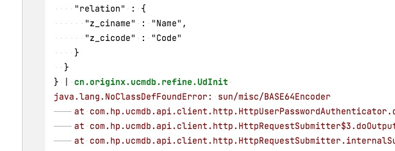
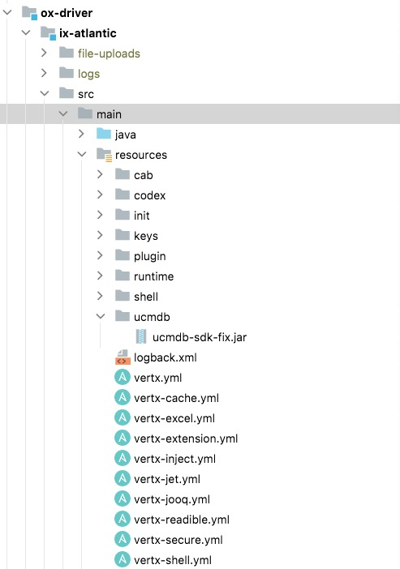
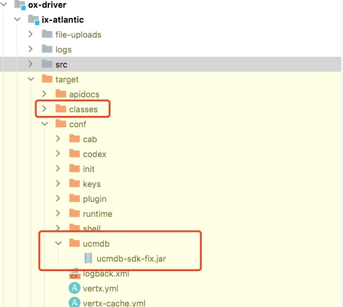
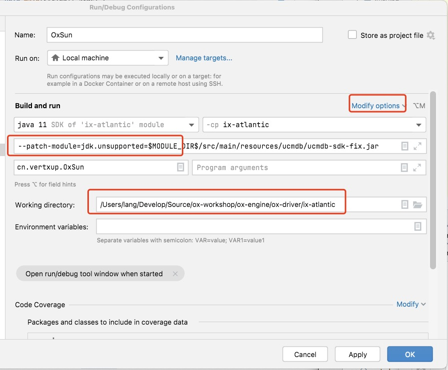
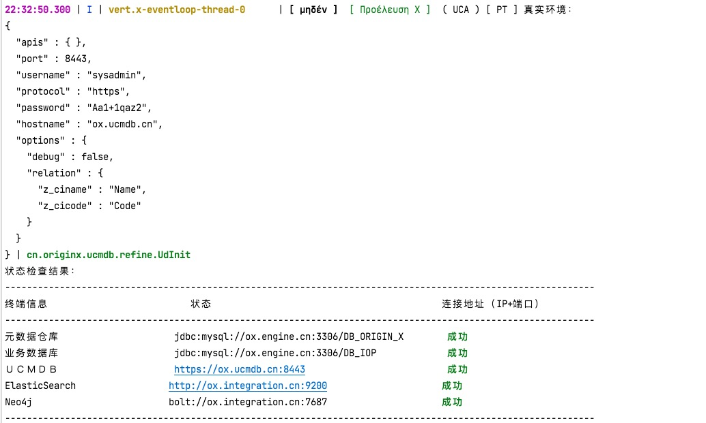

## 1. 问题描述

`UCMDB`SDK在`JDK11`上运行时会出现下边问题：



从JDK9之后，部分`sun.misc`包中的类已经全部从JDK中移除了，所以需要运行旧版本时打个PATCH。

## 2. IDEA运行

### 2.1. 原始位置

目前的版本已经把所需的jar打包到环境中了，位置：

```shell
src/main/resources/ucmdb/ucmdb-sdk-fix.jar
```



### 2.2. 编译后位置

```shell
target/conf/ucmdb/ucmdb-sdk-fix.jar（建议运行使用这个）
target/classes/ucmdb/ucmdb-sdk-fix.jar
```



### 2.3. IDEA配置修改

在IDEA运行配置中追加参数（JVM Options）:

```shell
--patch-module=jdk.unsupported=$MODULE_DIR$/src/main/resources/ucmdb/ucmdb-sdk-fix.jar
```



### 2.4. 正式运行命令中参数

```shell
# 参考脚本名：ix-atlantic/run-app.sh
# 另外还有一个脚本：ix-atlantic/run-config.sh
java --patch-module=jdk.unsupported=target/conf/ucmdb/ucmdb-sdk-fix.jar \
    -jar target/cmdb-zzbank-app.jar start
```

注意`jdk.unsupported`路径的位置，在生产和开发环境中应该是`conf/ucmdb/ucmdb-sdk-fix.jar`的路径。

## 3. 运行成功

